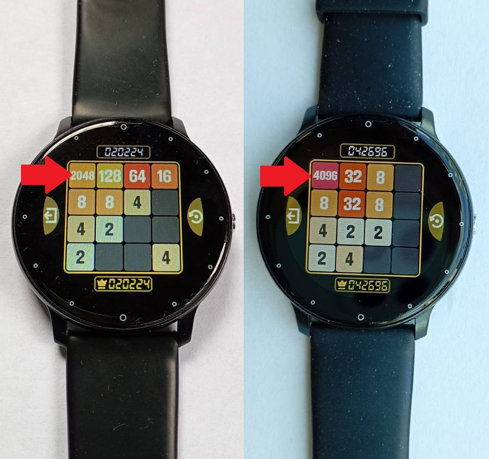
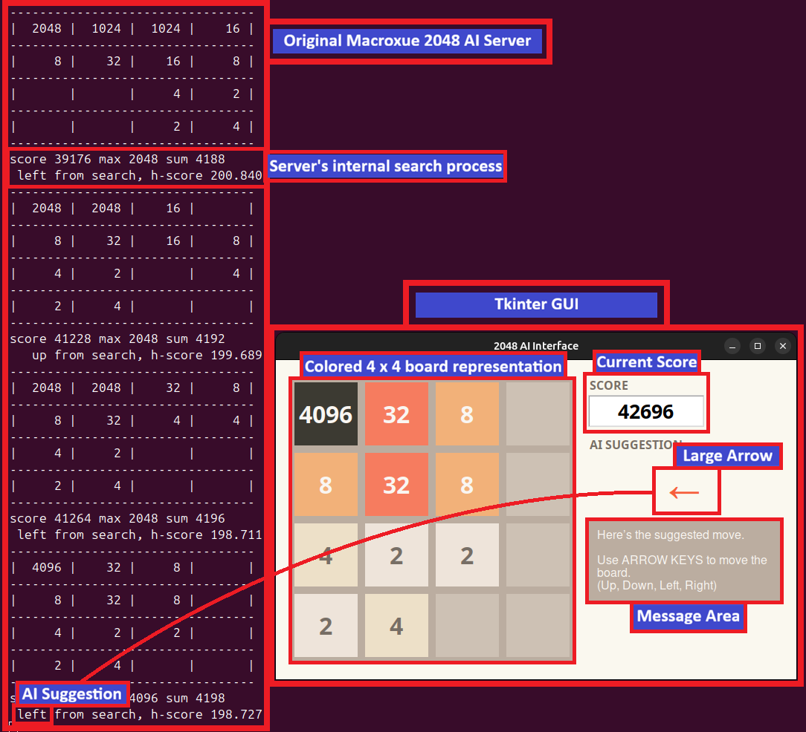

# 2048 AI Graphical Interface

A responsive Tkinter-based GUI designed to bridge the gap between high-performance AI solvers and real-world 2048 gameplay.

## 🌟 The Motivation

While AI engines like [macroxue/2048-ai](https://github.com/macroxue/2048-ai) are computationally brilliant, they are often difficult for humans to use in "real-time" on external devices.

This project provides the missing link: a **Human-in-the-loop** interface. By allowing players to quickly sync their physical game state (on phones, browsers, or even smartwatches) with a local AI server, we make high-level strategy accessible anywhere.

**Real-world proof:** The images below show a game in progress on a smartwatch, guided by this system, having already achieved the victorious **2048 tile** and the elusive **4096 tile**.



## Who is this for?

- Players who want to use strong AI guidance in real games

- Developers exploring human-in-the-loop AI tools

- Students learning Tkinter with a non-trivial state machine

## 🚀 Features

* **State-Driven Workflow:** Logic-locked states for Setup, Thinking, and Move Execution.

* **Intuitive Board Entry:** Left-click to increment tiles; Right-click to decrement.

* **Undo Support:** Full Ctrl-Z capability to revert accidental moves or sync errors.

* **Responsive UI:** Real-time AI move suggestions displayed with high-visibility graphic arrows.

* **Platform Aware:** Automatically detects OS to handle right-click variations (MacOS vs. Linux/Windows).

* **Cross-Platform Client:** GUI runs on Windows and Linux; AI server can run remotely on a Linux machine over LAN.

## 🛠️ Architecture

The system operates as a client-server model:

1. **GUI Client:** Written in Python/Tkinter. It encodes the 16-tile grid into a hexadecimal string (e.g., 0 for empty, B for 2048).

2. **AI Server:** The client sends an HTTP GET request to `http://localhost:8080/move?board=...`.

3. **Suggestion:** The server responds with a single character (u, d, l, r) representing the optimal move.

4. **States:** The states of this GUI client have this flow:

> ```
> SETUP → THINKING → MOVE_WAITING → MOVE_DONE → SETUP
> ```

## 🚦 Getting Started

### Prerequisites

* Python 3.x
* `requests` library

```Bash
pip install requests
```

*The only external dependency is `requests`*

### Running the Mock Server (Testing)

To test the GUI without the full AI engine, use the included dummy server. It responds with moves based on a weighted probability (Up: 55%, Left: 25%, Right: 15%, Down: 5%).

```Bash
python server/mock_ai_server.py
```

### Running the GUI

```Bash
python client/gui_client.py
```

## 🖥️ GUI in Action with the Real macroxue AI Server

The screenshot below shows the complete system working end-to-end:

- The **original macroxue 2048 AI server** running in the background

- This **Tkinter GUI** acting as a human-friendly client

- A real board state submitted to the AI

- A move suggestion returned via HTTP and rendered graphically



### What you are seeing in the screenshot

The image highlights both sides of the interaction:

**On the AI server side (terminal output):**

- The board state received by the server in text format

- The server’s internal lookup/search process

- The final move decision returned (`up`, `down`, `left`, `right`)

**On the GUI side (Tkinter application):**

- The colored 4×4 board representing the current game state

- The current score

- The AI suggestion displayed as a large directional arrow

- The message area indicating the current state of the workflow

This demonstrates that the GUI is not a mock or a visualization only — it is actively driving the real macroxue AI server.

## 🗺️ Roadmap

* [ ] Optional integration with the original **_macroxue server_** (platform-dependent).

* [ ] **Analyze tile spawn distribution:** track and report the statistical ratio of `2` vs. `4` tile spawns over time.

* [ ] Move history and "Win Probability" statistics.

## ⚠️ Disclaimers

**IMPORTANT NOTE:** The mock server does NOT implement any real AI and exists purely for UI testing.

### About the Real AI Server

This repository **does not include** the original macroxue 2048 AI server.

The real AI engine is developed and maintained here:
https://github.com/macroxue/2048-ai

If you want to run the real AI server:

- Follow the instructions in the macroxue repository README
- You will need a **Linux environment** to build and run it
- The setup and documentation there are clear and well explained

This project intentionally focuses on the **GUI and human interaction layer**, not on reimplementing or modifying the AI itself.

## 🌐 Cross-Platform Usage (Windows & Linux)

One of the key advantages of this GUI is that it is **fully cross-platform**.

### Supported setups

✔ GUI on **Linux**, AI server on **Linux**  
✔ GUI on **Windows**, AI server on **Linux** (same LAN)  
✔ GUI and AI server on the **same Linux machine**

The GUI communicates with the AI server via simple HTTP requests, which makes remote usage trivial.

### Using a remote AI server

If your macroxue AI server is running on a Linux machine in your local network:

1. Find the IP address of the Linux machine (for example: `192.168.0.9`)
2. Update the server URL in the GUI configuration:

```python
SERVER_URL = "http://192.168.0.9:8080"
```

That’s it — the GUI will now send board states to the remote AI server and display the returned suggestions.

This setup is particularly useful if:

* You have a powerful Linux desktop at home

* You use a Windows laptop without administrator privileges

* You want to keep the AI server running continuously on your LAN

## 📄 License

See the [LICENSE](LICENSE) file in this repository.